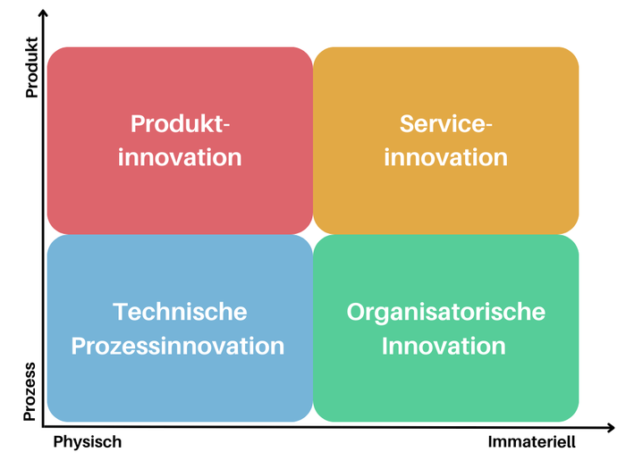

# Messung von Innovation

---

**Henne-Ei Problem:**
Sind Unternehmen aufgrund der Erfolgsfaktoren innovativ, oder sind diese Folgen der Innovation?

---

## Agenda

1. **Was ist Innovation?**
1. **Arten von Innovation**
1. **Messung von Innovation**
1. **Chancen und Grenzen der Messung von Innovation**

---

## Was ist Innovation?

_"Neuerung" oder "Erneuerung"_

_"Innovation bezieht sich auf die Schaffung, Verbesserung oder Ersetzung eines Prozesses, Produkts oder einer Dienstleistung"_

_"Innovation ist der Prozess, bei dem etwas Bestehendes verbessert wird, egal ob es sich um ein Produkt, eine Dienstleistung oder einen Prozess handelt"_

---

## Arten von Innovation

1. Produktinnovation
1. Dienstleistungs- / Serviceinnovation
1. Technische Prozessinnovation
1. Organisatorische Innovation

---

## Arten von Innovation

---

## Messung von Innovation

_"(...) Notwendigkeit eines umfassenden Verständnisses von betrieblicher Innovation."_ - **Schumpeter**

- Damit Innovation gemessen werden kann, muss sie funktionieren
- Damit sie funktioniern kann, muss sie universell verstanden werden

---

## Was?

### Was wird für Innovation eingesetzt?

- Kapital, Personal, Technologie

  - **Ressourcenorientierte Sichtweise**

- Direkt erfassbare, quantifizierbare Größen

= **Input**-Indikatoren

---

## Wie?

### Wie wird Innovation umgesetzt?

- Projekt-, Innovations-Management, Strategie, Innovationskultur

  - **Rountinen-Sichtweise**

- Latente, qualitative Größen

= **Operationalisierung**

---

## Was?

### Was sind Ergebnisse der Innovationsaktivitäten?

- Wirtschaftliche Effekte, Produkte, Kosten, Qualität, Zeit

  - **Wettbewerbsorientierte Sichtweise**

- Direkte erfassbare, quantifizierbare Größen

= **Output**-Indikatoren

---

## Wie kann man Innovation messen?

**Problem**:

Die Messung der Innovationsleistung erfolgt in der Regel ad hoc, wobei die verwendeten Messgrößen von Jahr zu Jahr erheblich variieren können.

Innovation erfolgreich zu messen ist eine Kombination aus verschiedenen Messgrößen

---

## Wie kann man Innovation messen?

**1. Anzahl der finanzierten Ideen**

- Frontend der Innovation
- Anzahl neuer Ideen, die genügend Interesse wecken können, um zu einer formellen Mittelverpflichtung zu führen.

---

## Wie kann man Innovation messen?

**2. Return on Investment (ROI) oder Kapitalwert eines Projekts**

- Wenn Unternehmen in Innovation investieren, müssen mit diesen Investitionen Renditen erzielt werden
- Geben diese Maßnahmen Aufschluss über ein positives Ergebnis in der Zukunft, kann daraus eine erfolgreiche Innovation abgeleitet werden

---

## Wie kann man Innovation messen?

**3. Innovatoren in Senior Positionen / CEO Commitment**

Wie viele Senior- oder C-Level-Angestellte haben diese Positionen durch die Umsetzung neuer Ideen, die für einen Mehrwert gesorgt haben, erreicht?

- Für langfristigen Erfolg liegt der Schwerpunkt auf der Förderung innovativer Denker
- Indikator für den tatsächlichen Wert von Innovation im Unternehmen

---

## Wie kann man Innovation messen?

**4. Langfristige Kundenakzeptanz**

- Innovationserfolg wird anhand des Erfolgs neuer Produkte und Dienstleistungen bewertet
- Kundenorientierte Maßnahmen sollen zur Festigung der Kundenbindung führen.
  **"Schaffen Sie Fans, nicht nur Kunden."**
- Innovation ist dann erfolgreich, wenn bestehende Kunden neue Angebote mit Spannung erwarten und Schlange stehen, um sie zu kaufen.

---

## Wie kann man Innovation messen?

**Langfristige Kundenakzeptanz**

Beispiel:
Ein deutscher Automobilhersteller bringt einen Nachfolger für sein erfolgreichstes Modell auf den Markt. Dies lässt sein Vorgängermodell alt aussehen, kann aber die Verkaufszahlen nicht erreichen.

---

## Wie kann man Innovation messen?

**Langfristige Kundenakzeptanz**

Der Hersteller hat eine Innovation auf den Markt gebracht, denn das neue Modell hat die Kosten für Entwicklung und Markteinführung wieder reingeholt. Doch die Innovation hat nicht positiv auf das Ergebnis des Unternehmens beigetragen und den Absatz des Vorgängermodells abgewürgt.

---

## Chancen und Grenzen der Messung von Innovation

### Chancen

- Aufbau internationaler Indikatorensysteme

  - **Oslo-Model** (Leitlinie für Erhebung, Reporting und Nutzung von Daten über Innovation)

- Verbreitung eines ganzheitlichen Innovationsverständnisses

---

## Chancen und Grenzen der Messung von Innovation

### Chancen und Grenzen

- Noch unterschiedlich ausgereifte Messung von Innovationsfeldern

- Produktinnovation = gut messbar

- Weiterentwicklung bei Service und nicht-technischen Prozessinnovationen

---

## Chancen und Grenzen der Messung von Innovation

### Grenzen

- Erfassung von Innovationen in Controlling Prozessen
- Einheitliche Messungen
  - Verzerrung durch Selbsteinschätzung
- Time-Lag Problem (Verzögerungseffekt)
- Größe des Wettbewerbsumfeldes

---

## Vielen Dank für die Aufmerksamkeit!
